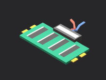
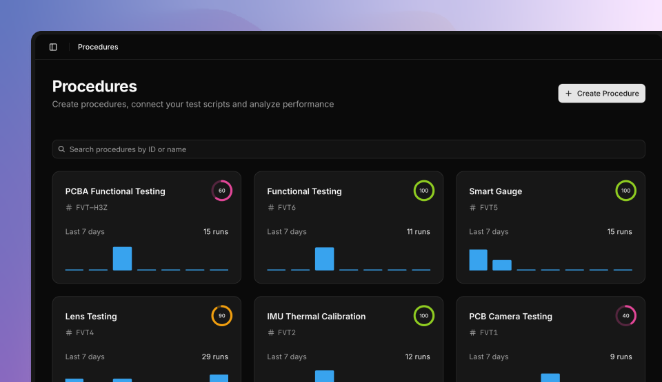
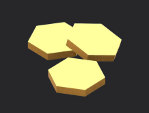

# Welcome to TofuPilot

We help hardware engineers build and deploy hardware tests faster.

## Products

We maintain several products:

### [Framework](https://tofupilot.com/docs/framework)

Our open-source Python testing framework for hardware validation and production testing.

### [Studio](https://www.tofupilot.com/docs/framework/environments/studio)

A desktop application for developing, debugging, and running your hardware tests locally.

### [Dashboard](https://tofupilot.com/docs/dashboard)

A web-based analytics and monitoring platform for your test data and production insights.

## Trusted By

From autonomous farming robots to humanoid robots, aerospace systems to defense electronics, hardware companies use TofuPilot to test their products faster.

<table>
<tr>
<td width="33%" align="center">Ecorobotix</td>
<td width="33%" align="center">Enchanted Tools</td>
<td width="33%" align="center">Pacific Defense</td>
</tr>
<tr>
<td width="33%" align="center"></td>
<td width="33%" align="center"></td>
<td width="33%" align="center"></td>
</tr>
<tr>
<td width="33%" align="center">Tools For Humanity</td>
<td width="33%" align="center">Enlightra</td>
<td width="33%" align="center">FixturFab</td>
</tr>
<tr>
<td width="33%" align="center"></td>
<td width="33%" align="center"></td>
<td width="33%" align="center"></td>
</tr>
</table>

## About

**TofuPilot Framework** is maintained by the crew of [TofuPilot](https://www.tofupilot.com/about).

We're a team of robotics, data and quality engineers based out of Switzerland who believe hardware tests deserve the same love as your production code.

## Community

You can join our [Discord](https://discord.gg/fK3AeTyngh) server to ask anything, report an issue, or get latest updates on TofuPilot features and changes.

You can also raise issues on this [repository](https://github.com/tofupilot/framework/issues) directly.

## Support Us

We'd love your support through feedback, bug reports, feature requests, and spreading the word to your hardware friends.

The best way to support our team is getting a [TofuPilot Pro](https://www.tofupilot.com/pricing) account to get plug-and-play database and analytics for all your tests.
